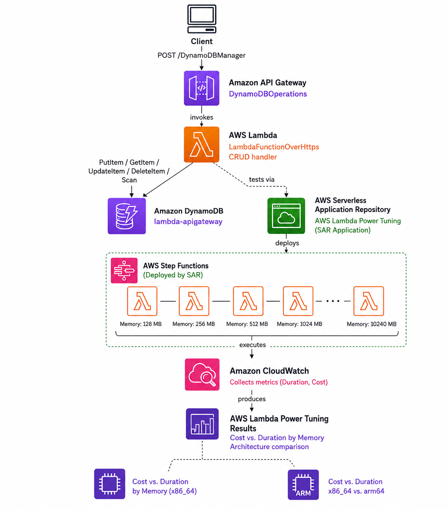
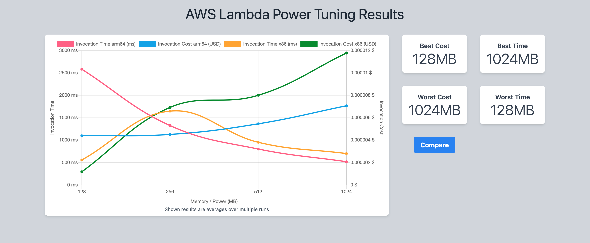
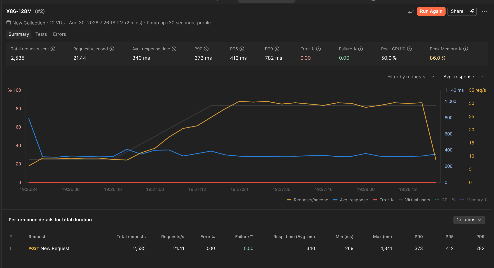
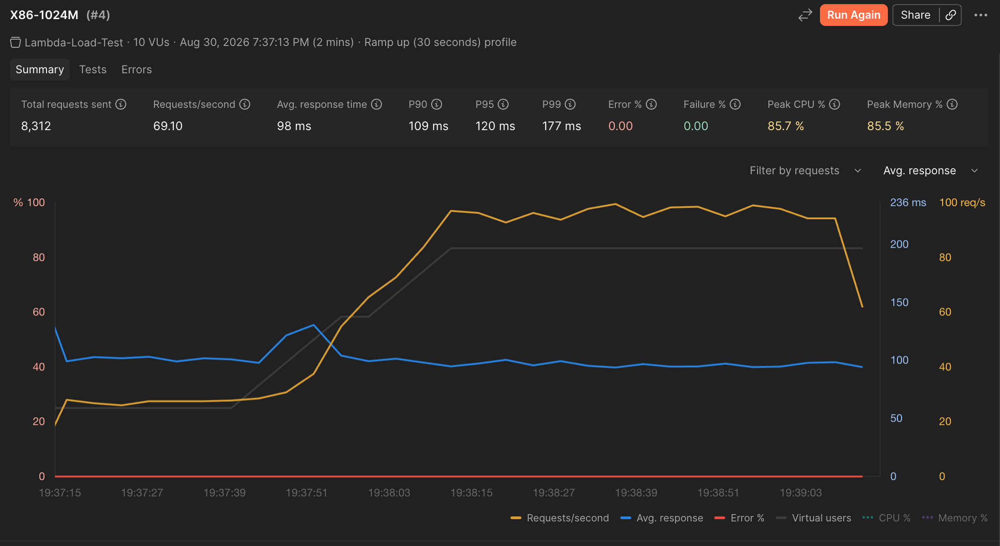
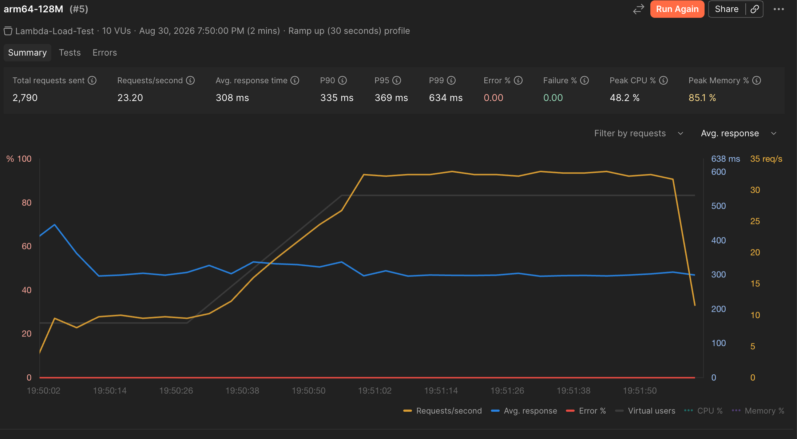
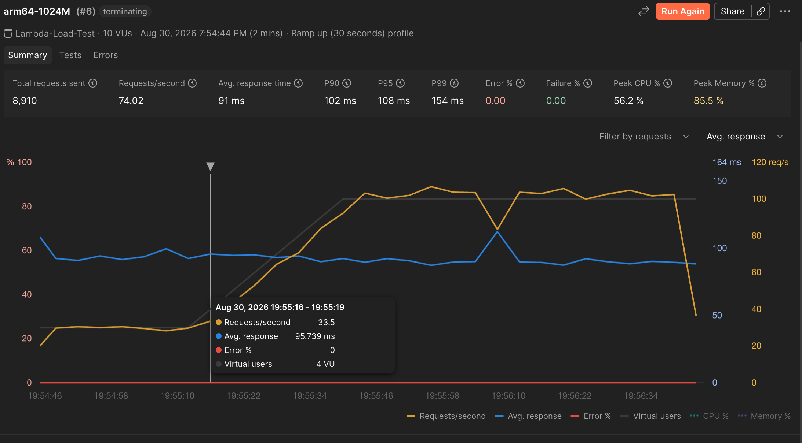

# Serverless CRUD Microservice — Cost/Performance Tuning Across Processor Architectures

A serverless CRUD API on API Gateway, Lambda, and DynamoDB, with a
memory and processor-architecture tuning exercise on top — comparing
the same function's cost and performance on x86_64 versus ARM64
(Graviton2) using AWS Lambda Power Tuning and a sustained load test,
plus a cost comparison applying AWS's published per-GB-second pricing
to the measured results.

## Architecture



## Components

| Component | Role |
|---|---|
| **API Gateway** (`DynamoDBOperations`) | Public REST endpoint, `POST /DynamoDBManager`, deployed to a `prod` stage |
| **LambdaFunctionOverHttps** | CRUD handler — routes on an `operation` field (`create`, `read`, `update`, `delete`, `list`) |
| **DynamoDB** (`lambda-apigateway`) | Backing store, partition key `id` (string) |
| **Lambda Power Tuning** | Open-source tool, run twice — once per processor architecture |

## Why architecture, not just memory

Most Lambda cost tuning stops at memory allocation. AWS Lambda also lets
you choose the underlying processor architecture — **x86_64** (the
default) or **arm64 (Graviton2)** — and Graviton2 is generally priced
lower per GB-second, with comparable or better performance for many
workloads. Since Lambda Power Tuning already measures cost and execution
duration across memory settings, running the same sweep a second time
with only the architecture changed turns a single-variable tuning
exercise into a two-variable one, using the same tool and the same
function.

**Approach:**
1. Run Power Tuning against `LambdaFunctionOverHttps` on x86_64 (the
   default) across the memory values in `power-tuning-input.json`.
2. Switch the function's architecture to `arm64` under Lambda →
   Configuration → General configuration. No code changes were needed —
   this function's only dependency is `boto3`, which the Lambda runtime
   provides natively on both architectures.
3. Re-run Power Tuning with the same input and memory values.
4. Compare the two result graphs — see Results below.

## IAM

`LambdaFunctionOverHttps` uses a least-privilege execution role — see
`/iam/crud-lambda-policy.json` — scoped to only the specific DynamoDB
item-level actions the CRUD handler needs.

## Results — Lambda Power Tuning (single-invocation, cold-start-heavy)

Power Tuning ran 10 parallel invocations per memory tier — at that sample
size and concurrency, nearly every invocation is a cold start rather than
a warm, steady-state execution (see the note under Cost Comparison below
on why this matters).



**Data (read from the chart above):**

| Memory | x86_64 time | x86_64 cost | arm64 time | arm64 cost |
|---|---|---|---|---|
| 128 MB | ~550 ms | lowest of the four series | ~2,600 ms | mid-range |
| 256 MB | ~1,650 ms | rising sharply | ~1,300 ms | flat/low |
| 512 MB | ~950 ms | high | ~800 ms | rising |
| 1024 MB | ~700 ms | highest of the four series | ~500 ms | second-lowest |

At 128 MB specifically, Power Tuning shows arm64 as roughly **5x slower**
than x86_64 — this is a cold-start artifact, not a representative
production number (see below).

**My take:**

> This is the result that initially looked backwards to me — arm64 coming
> in at roughly 5x slower than x86_64 at the lowest memory tier isn't
> what I expected going in, given AWS markets Graviton2 as the
> faster *and* cheaper option. The gap closing almost completely by
> 512 MB, and arm64 actually taking the lead by 1024 MB, is the bigger
> tell here: whatever is driving the 128 MB gap is concentrated at that
> thin memory allocation specifically, not a general arm64 weakness. I
> wouldn't trust this chart alone to decide against arm64 for a
> production workload — it's a 10-invocation sample, which is small
> enough that a handful of unlucky cold starts can swing the average
> significantly. Before making an architecture decision based on this,
> I'd want a much larger, non-parallel sample at 128 MB specifically to
> see if the gap holds up.

## Results — Load Test (sustained, warm-traffic-representative)

10 virtual users, 30-second ramp-up, 2-minute sustained run, via Postman.

| x86_64, 128 MB | x86_64, 1024 MB |
|---|---|
|  |  |

| arm64, 128 MB | arm64, 1024 MB |
|---|---|
|  |  |

**Data:**

| Run | Avg. response | P90 | P95 | P99 | Peak CPU |
|---|---|---|---|---|---|
| x86_64, 128 MB | 340 ms | 373 ms | 412 ms | 782 ms | 50.0% |
| x86_64, 1024 MB | 98 ms | 109 ms | 120 ms | 177 ms | 85.7% |
| arm64, 128 MB | 308 ms | 335 ms | 369 ms | 634 ms | 48.2% |
| arm64, 1024 MB | 91 ms | 102 ms | 108 ms | 154 ms | 56.2% |

Two things stand out here that Power Tuning's numbers don't show:

- **Under sustained load, arm64 is comparable to or faster than x86_64 at
  both memory tiers** — the opposite of what the cold-start-heavy Power
  Tuning run suggested at 128 MB.
- **At 1024 MB, arm64 handled more throughput (74.02 req/s vs. 69.10
  req/s) while using meaningfully less peak CPU (56.2% vs. 85.7%)** —
  same workload, same memory, less headroom consumed to do more work.
- **The P95→P99 gap narrows sharply as memory increases** (128 MB: 369 ms
  → 634 ms, nearly double; 1024 MB: 108 ms → 154 ms, a much smaller
  jump). Higher memory doesn't just lower the average — it makes response
  times more consistent, with fewer slow outliers in the tail.

**My take:**

> This is the result I'd actually act on. Under real sustained traffic,
> arm64 wasn't just cheaper on paper, it was genuinely faster at both
> memory settings I tested, and it got there using noticeably less CPU
> headroom at 1024 MB (56.2% vs. 85.7% peak). That CPU gap matters beyond
> just this test — it suggests arm64 has more room before it would need
> a bump in memory to keep up with the same traffic, which is a second,
> less obvious cost lever on top of the per-GB-second rate difference.
> If I were choosing a memory setting for this function in production,
> I'd lean toward 1024 MB regardless of architecture, since the P99
> improvement (782 ms down to 177 ms on x86_64 alone) is a bigger factor
> for user experience than the small extra cost per invocation. The
> single-invocation Power Tuning chart above would never have surfaced
> the CPU utilization difference at all, since it doesn't report CPU —
> that's specifically why I ran both tools rather than relying on just
> one.

**Why the two tools disagree at low memory:** Power Tuning's small,
highly-parallel sample (10 invocations, fired concurrently) is dominated
by cold starts, while the load test's thousands of sustained requests are
overwhelmingly served by already-warm containers — so the two tools are
largely measuring different things: cold-start cost vs. steady-state
throughput. That sampling difference is likely part of the story, but not
necessarily all of it. Published benchmarks on arm64 vs. x86_64 cold
start behavior are genuinely mixed — some report arm64 cold starts as
13-24% *faster* across most runtimes, others report the opposite for
interpreted languages, and at least one benchmark found the winner
depends on package size (x86_64 ahead under ~4 MB, arm64 ahead above it)
rather than architecture alone. So it's plausible this function has a
real, if smaller, arm64 cold-start disadvantage at 128 MB specifically,
on top of the sampling bias — disentangling the two would require
re-running Power Tuning with a much larger, non-parallel sample rather
than assuming the gap is sampling artifact alone. Either way, for a
production API expected to see continuous traffic, **the load test
numbers are the more representative ones**, and they're what the cost
comparison below is built on.

## Cost Context

AWS prices arm64 (Graviton2) duration at a flat **20% lower rate per
GB-second** than x86_64 ($0.0000133334 vs. $0.0000166667). The per-request
charge is identical across both architectures. That rate advantage is
AWS's published number, independent of any specific workload.

What this repo's load test adds on top of that advertised rate is the
**performance** side of the comparison — see Results — Load Test above:
at both memory tiers, arm64 matched or beat x86_64 on response time
(91 ms vs. 98 ms at 1024 MB, 308 ms vs. 340 ms at 128 MB) while using
less peak CPU to do it (56.2% vs. 85.7% at 1024 MB). Since Lambda's
duration charge depends on both the per-GB-second rate *and* how long
the function actually runs, arm64's real-world advantage here is the
20% lower rate **plus** a genuine, measured performance edge on this
specific workload, not just AWS's advertised discount alone.

## Setup

### 1. Create the IAM policy and execution role

1. Open the **IAM console → Policies → Create policy**.
2. Switch to the **JSON** tab and paste the following:

```json
{
  "Version": "2012-10-17",
  "Statement": [
    {
      "Sid": "DynamoDBTableAccess",
      "Effect": "Allow",
      "Action": [
        "dynamodb:PutItem",
        "dynamodb:GetItem",
        "dynamodb:UpdateItem",
        "dynamodb:DeleteItem",
        "dynamodb:Scan",
        "dynamodb:Query"
      ],
      "Resource": "arn:aws:dynamodb:*:*:table/lambda-apigateway"
    },
    {
      "Sid": "CloudWatchLogs",
      "Effect": "Allow",
      "Action": [
        "logs:CreateLogGroup",
        "logs:CreateLogStream",
        "logs:PutLogEvents"
      ],
      "Resource": "*"
    }
  ]
}
```

3. Name it `crud-lambda-policy` and click **Create policy**.
4. Go to **IAM console → Roles → Create role**.
5. Trusted entity type: **AWS service** → Use case: **Lambda** → Next.
6. Search for `crud-lambda-policy`, select it, and click Next.
7. Name the role `lambda-apigateway-role` and click **Create role**.

### 2. Create the Lambda function

1. Open the **Lambda console → Create function → Author from scratch**.
2. Function name: `LambdaFunctionOverHttps`. Runtime: **Python 3.13**.
   Architecture: leave as **x86_64** for the first pass.
3. Under **Permissions**, expand "Change default execution role" →
   **Use an existing role** → select `lambda-apigateway-role`.
4. Click **Create function**.
5. In the code editor, replace the boilerplate with:

```python
from __future__ import print_function
import boto3
import json

print('Loading function')


def lambda_handler(event, context):
    '''
    Expected event shape:
      - operation: one of the operations in the operations dict below
      - tableName: required for operations that interact with DynamoDB
      - payload: parameters passed to the operation being performed
    '''
    operation = event['operation']

    if 'tableName' in event:
        dynamo = boto3.resource('dynamodb').Table(event['tableName'])

    operations = {
        'create': lambda x: dynamo.put_item(**x),
        'read': lambda x: dynamo.get_item(**x),
        'update': lambda x: dynamo.update_item(**x),
        'delete': lambda x: dynamo.delete_item(**x),
        'list': lambda x: dynamo.scan(**x),
        'echo': lambda x: x,
        'ping': lambda x: 'pong'
    }

    if operation in operations:
        return operations[operation](event.get('payload'))
    else:
        raise ValueError('Unrecognized operation "{}"'.format(operation))
```

6. Click **Deploy**.
7. Test it in isolation before wiring up anything else: click the **Test**
   tab, name the event `echotest`, and use this payload:

```json
{
  "operation": "echo",
  "payload": {
    "somekey1": "somevalue1",
    "somekey2": "somevalue2"
  }
}
```

8. Click **Test** — you should see the same payload echoed back in the
   execution result, confirming the function runs before anything else
   is connected to it.

### 3. Create the DynamoDB table

1. Open the **DynamoDB console → Tables → Create table**.
2. Table name: `lambda-apigateway`.
3. Partition key: `id`, type **String**.
4. Leave all other settings at their defaults and click **Create table**.

### 4. Create and deploy the API Gateway

1. Open the **API Gateway console → Create API → REST API → Build**.
2. API name: `DynamoDBOperations`. Click **Create API**.
3. Click **Create Resource**, name it `DynamoDBManager`, click
   **Create Resource**.
4. With `/dynamodbmanager` selected, click **Create Method**.
5. Method type: **POST**. Integration type: **Lambda function**.
   Select `LambdaFunctionOverHttps`. Click **Create method**.
6. Click **Deploy API** (top right). Stage: **[New Stage]**, name it
   `prod`. Click **Deploy**.
7. Under **Stages → prod**, expand until you see the `POST` method under
   `/dynamodbmanager`, and copy the **Invoke URL** — this is your live
   endpoint.

### 5. Test end to end

Using the invoke URL from the previous step, send a create request:

```bash
curl -X POST -d '{"operation":"create","tableName":"lambda-apigateway","payload":{"Item":{"id":"1234ABCD","number":5}}}' \
  https://YOUR-API-ID.execute-api.YOUR-REGION.amazonaws.com/prod/dynamodbmanager
```

A `200` response confirms the full chain — API Gateway → Lambda →
DynamoDB — is working. Confirm the item landed by opening the
`lambda-apigateway` table in the DynamoDB console and clicking
**Explore table items**.

### 6. Deploy and run Lambda Power Tuning

1. Go to the **Serverless Application Repository** (search "Serverless
   Application Repository" in the AWS console, or find it under
   Lambda → Applications → Create application → Public applications).
2. Search for `power`, and check **"Show apps that create custom IAM
   roles or resource policies."**
3. Select **aws-lambda-power-tuning**, scroll down, check **"I
   acknowledge that this app creates custom IAM roles,"** and click
   **Deploy**.
4. Once deployed, go to **Step Functions** and find
   `powerTuningStateMachine`.
5. Click **Start execution**. Get your Lambda's ARN from the Lambda
   console (top right of the function's page) and use this input,
   replacing the ARN:

```json
{
  "lambdaARN": "YOUR LAMBDA ARN HERE",
  "powerValues": [128, 256, 512, 1024, 1536],
  "num": 10,
  "payload": {
    "operation": "list",
    "tableName": "lambda-apigateway",
    "payload": {}
  },
  "parallelInvocation": true,
  "strategy": "balanced"
}
```

6. Once the execution finishes, open the **Execution input and output**
   tab, and copy the **visualization link** it returns. Open it in a new
   browser tab — this is the cost/time graph shown in Results above.

### 7. Re-run Power Tuning on arm64

1. Back in the Lambda console, open `LambdaFunctionOverHttps` →
   **Configuration → General configuration → Edit**.
2. Change **Architecture** to **arm64**, and click **Save**. No code
   changes are needed — this function's only dependency is `boto3`,
   which the Lambda runtime provides natively on both architectures.
3. Repeat steps 4–6 above (same Step Functions state machine, same
   input JSON) to get the arm64 results graph.

### 8. Load test with Postman (run once per architecture/memory combo you want to compare)

1. Install [Postman](https://www.postman.com/downloads/) if you don't
   have it.
2. Under **Collections**, click **+** → **Blank Collection**, give it a
   name (e.g., `Lambda-Load-Test`).
3. Click **Add a request**. Change the method from `GET` to **POST**,
   and paste in your API Gateway invoke URL from Step 4.
4. Under **Body → raw**, paste:

```json
{
  "operation": "list",
  "tableName": "lambda-apigateway",
  "payload": {}
}
```

5. **Click Save** — the request won't persist in the collection
   otherwise.
6. Click the **"..."** next to the **collection name** (not the request
   itself) and select **Run**.
7. Under **Load Profile**, select **Ramp up**, set **Virtual users** to
   **10**, and **Test duration** to **2 minutes**. Click **Run**.
8. Once the 2-minute run completes, export the results (there's a
   download/export option in the run summary) and note the average
   response time, P90/P95/P99, and peak CPU/memory — this is the data
   shown in the Load Test results table above.
9. To compare memory settings or architectures, change the setting on
   the Lambda function (Configuration → General configuration for
   memory, or Architecture as in Step 7), then click **Run Again** on
   the same collection and export a new result.
